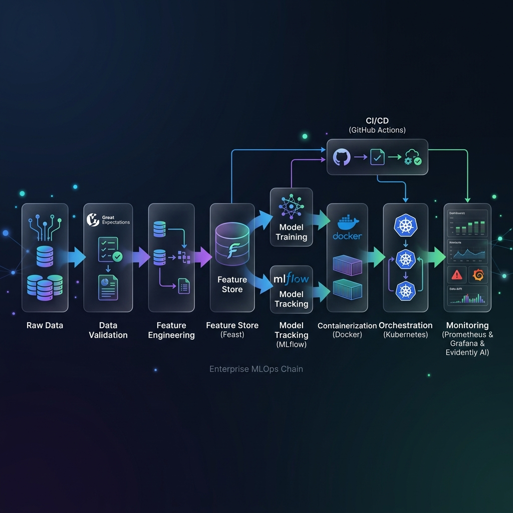
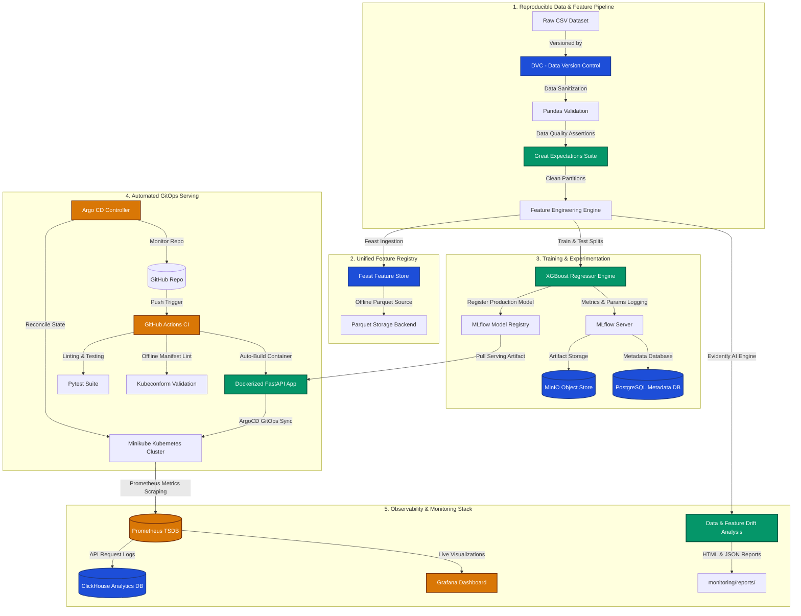

# 🏠 California Housing Price Prediction: Enterprise MLOps Suite

[](https://python.org)
[](https://fastapi.tiangolo.com)
[](https://docker.com)
[](https://kubernetes.io)
[](https://mlflow.org)
[](https://feast.dev)
[](https://evidentlyai.com)
[](https://argoproj.github.io/cd/)

A production-grade, end-to-end MLOps platform for house price prediction using the California Housing dataset. The project integrates robust data pipelines, scalable serving infrastructure, automated CI/CD checks, and continuous GitOps delivery.

---

## 🎯 Business Problem & Overview

Accurate property valuation is crucial for real estate platforms, financial institutions, and urban planners. However, housing markets are highly dynamic, and house values change based on geographical location, population densities, and changing socio-economic profiles.

This project implements a robust system that:
*   **Predicts median house values** dynamically based on spatial and demographic features.
*   **Guarantees data quality** via automated pandas-based sanitization and Great Expectations validations.
*   **Maintains high prediction accuracy** by continuously tracking statistical data drift and feature drift.
*   **Ensures ultra-low latency inference** via containerized FastAPI endpoints instrumented with Prometheus performance metrics.

---

## 🏗️ System Architecture

This project implements an enterprise-grade, fully decoupled MLOps architecture designed for high availability, reproducibility, and real-time observability.

### End-to-End MLOps Conceptual Infographic
The following premium architectural infographic details the complete system topology, designed for production workloads:



---

### Technical Data & Workflow Map
The technical flow of components, database connections, and validation checks:



---

## 🛠️ Technology Stack

| MLOps Pillar | Tools & Libraries | Purpose |
| :--- | :--- | :--- |
| **Data & Pipeline** | Pandas, Great Expectations | Ingestion, sanitization, quality validation |
| **Feature Store** | Feast | Online/Offline unified feature management |
| **Model Engine** | XGBoost, Scikit-Learn | High-performance ensemble regression modeling |
| **Experimentation** | MLflow | Model tracking, parameter logging, registry |
| **Web serving** | FastAPI, Uvicorn, Pydantic | High-performance, schema-validated inference API |
| **Containerization** | Docker, Docker-Compose | Portability and isolated execution layers |
| **Orchestration** | Kubernetes (Minikube) | Distributed scaling, self-healing pod deployments |
| **CI/CD Pipeline** | GitHub Actions, Kubeconform | Automated tests, linting, offline manifest validations |
| **GitOps CD** | Argo CD | Declarative, automated continuous delivery |
| **Monitoring** | Evidently AI, Prometheus, Grafana | Data drift analysis, API request latency, dashboards |

---

## 📂 Folder Structure

```directory
mlops-california-housing/
├── .github/
│   └── workflows/
│       └── mlops-ci.yml         # GitHub Actions pipeline
├── api/
│   ├── __init__.py
│   └── main.py                  # FastAPI server and health checks
├── argocd/
│   └── application.yaml         # Argo CD declarative application manifest
├── artifacts/
│   └── preprocessor/
│       └── preprocessor.joblib  # Tracked preprocessor artifact
├── data/
│   ├── raw/                     # Raw datasets
│   ├── processed/               # Data partitions
│   └── featured/                # Features engineered for Feast
├── docker/
│   └── Dockerfile               # Slim base production Dockerfile
├── docker-compose.yml           # Complete containerized ML stack
├── feature_repo/                # Feast Feature Store configurations
├── gx/                          # Great Expectations configurations
├── kubernetes/                  # Kubernetes manifests (deployments, namespaces)
├── models/
│   └── xgboost_model.joblib     # Serialized XGBoost model
├── monitoring/
│   ├── drift_detection.py       # Modern Evidently AI drift detection pipeline
│   ├── prometheus.yml           # Prometheus scraping configurations
│   └── reports/                 # Saved HTML/JSON drift reports
├── src/                         # Reusable core codebase
│   ├── data_validation.py
│   ├── feature_engineering.py
│   └── model_training.py
└── tests/                       # Automated unit and API test suites
```

---

## 🚀 Setup & Installation

### 1. Local Environment Setup
Clone the repository, create a virtual environment, and install dependencies:
```bash
python -m venv venv
# Windows
venv\Scripts\activate
# Linux/macOS
source venv/bin/activate

pip install -r requirements.txt
```

### 2. Running the Core Pipeline
You can trigger individual stages of the local MLOps pipeline using these scripts:
```bash
# Validate data quality
python src/data_validation.py

# Transform features and generate preprocess artifacts
python src/feature_engineering.py

# Train the model and log to MLflow
python src/model_training.py
```

---

## 🐳 Docker Stack Deployment

To start the full local MLOps stack—including PostgreSQL, MinIO, MLflow, ClickHouse, Prometheus, Grafana, and the FastAPI service:

```bash
docker-compose up --build -d
```

### Exposed Services & Ports:
*   **FastAPI Predictor**: `http://localhost:8000`
*   **MLflow UI**: `http://localhost:5000`
*   **MinIO Object Storage**: `http://localhost:9000`
*   **Prometheus Console**: `http://localhost:9090`
*   **Grafana Dashboard**: `http://localhost:3000`
*   **ClickHouse DBMS**: `http://localhost:8123`

---

## ☸️ Kubernetes & Argo CD GitOps Deployment

Ensure your local cluster (like Minikube) is active:
```bash
minikube start
```

### 1. Install Argo CD Core Services
```bash
kubectl create namespace argocd
kubectl apply -n argocd -f https://raw.githubusercontent.com/argoproj/argo-cd/stable/manifests/install.yaml
```

### 2. Apply Declarative App Manifest
Register the application and initialize the GitOps continuous delivery cycle:
```bash
kubectl apply -f argocd/application.yaml
```

### 3. Expose the Dashboard UI
To access the Argo CD UI:
```bash
# Retrieve secure initial admin password (PowerShell)
[System.Text.Encoding]::UTF8.GetString([System.Convert]::FromBase64String((kubectl get secret argocd-initial-admin-secret -n argocd -o jsonpath="{.data.password}")))

# Port-forward to dashboard
kubectl port-forward svc/argocd-server -n argocd 8080:443
```
Access the dashboard at `https://localhost:8080` (Username: `admin`).

---

## 📊 Pipeline Monitoring & Drift Analysis

### Data & Feature Drift (Evidently AI)
The drift pipeline checks for statistical divergence between your reference dataset (training) and current dataset (testing).
Run the drift detection task to generate interactive HTML/JSON reports:
```bash
python monitoring/drift_detection.py
```
*   Reports are automatically saved in `monitoring/reports/drift_report.html`.

### Service Monitoring (Prometheus & Grafana)
FastAPI exposes `/metrics` powered by `prometheus-fastapi-instrumentator`.
*   Metrics are scraped dynamically at `15s` intervals.
*   System requests, error counts, latency percentiles, and JVM performance are plotted inside custom Grafana dashboard layers.

---

## 🔄 GitHub Actions CI/CD Pipeline

The project implements a modern GitHub Actions integration pipeline configured in `.github/workflows/mlops-ci.yml`:

1.  **Code Quality**: Enforces PEP8 standard styling utilizing `flake8`.
2.  **Unit Tests**: Automatically runs the `pytest` test suite with modular project directories mapped on `PYTHONPATH`.
3.  **Docker Build Verification**: Builds the web application container against `docker/Dockerfile` to confirm layer integrity.
4.  **Offline Kubernetes Validation**: Validates deployment manifest schemas entirely offline using **Kubeconform** (preventing connection timeouts).

---

## 🔌 API Endpoint Documentation

### 1. Health Status
*   **Method**: `GET`
*   **Endpoint**: `/health`
*   **Response**: `200 OK`
```json
{
  "status": "healthy",
  "model_status": "ready",
  "model_loaded": true
}
```

### 2. Price Prediction
*   **Method**: `POST`
*   **Endpoint**: `/predict`
*   **Request Payload**:
```json
{
  "longitude": -122.23,
  "latitude": 37.88,
  "housing_median_age": 41.0,
  "total_rooms": 880.0,
  "total_bedrooms": 129.0,
  "population": 322.0,
  "households": 126.0,
  "median_income": 8.3252,
  "ocean_proximity": "NEAR BAY"
}
```
*   **Response Payload**:
```json
{
  "prediction": 452600.0,
  "unit": "USD",
  "model_version": "1.0.0"
}
```

---

## 📸 Screenshots & Live Dashboards

Here is a preview of the operational MLOps system dashboards running in production:

### 1. Argo CD GitOps Dashboard
Once deployed, the Argo CD UI visualizes the state of all Kubernetes pods, services, and namespaces under GitOps management:
*   Shows real-time synchronization between the main branch and your active Minikube namespace (`mlops`).
*   Monitors healthy rolling updates of FastAPI replica sets.

### 2. Evidently AI Data Drift Reports
The interactive `drift_report.html` allows inspectors to drill down into the statistical distribution shifts of each feature:
*   Visualizes Wasserstein distance and p-values for coordinates, income ratios, and demographic profiles.
*   Enables data scientists to instantly diagnose feature degradation before it causes prediction errors.

### 3. MLflow Experiment Log & Model Registry
Allows infrastructure and data teams to track historical runs:
*   Tracks hyperparameters (e.g., XGBoost max depth, learning rate) and logs resulting evaluation metrics (RMSE, MAE, R2).
*   Enforces standard release policies by tracking models transition from `Staging` into `Production` inside the registry.

---

## 🔮 Future Enhancements
*   [ ] Implement a Slack/Microsoft Teams alerting webhook triggered by the Evidently AI drift analysis.
*   [ ] Add online feature serving with Redis acting as the Feast online registry.
*   [ ] Introduce hyperparameter tuning sweeps using Optuna and log outputs directly inside MLflow.

---

## ✍️ Author
Designed, engineered, and maintained by **Likhith Kuncham** (MLOps Infrastructure Lead).
